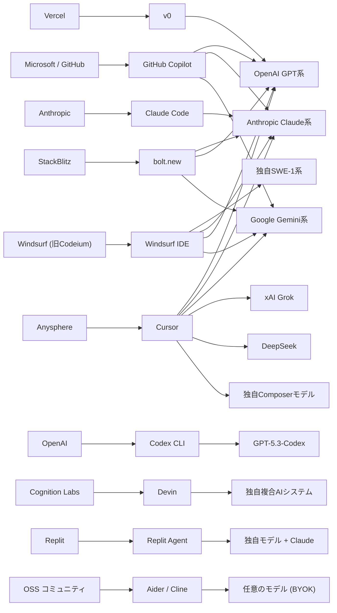

## 概要

Agentic Coding（AIエージェントによる自律的なコーディング）および Vibe Coding（自然言語でアプリを生成するスタイル）に利用される主要ツール、AIモデル、開発企業の関連を俯瞰的にまとめる。ツールとモデルの対応関係、各モデルの技術的特徴と類似性を明らかにする。

:::info 関連ドキュメント
- [E2Eテスト×AI：自動解析・修正のトレンド](/docs/testing/playwright-ai-e2e-testing-trends) - AIコーディングツールのテスト領域での活用
:::

## 背景・動機

2025年末時点で約85%の開発者がAIツールを日常的にコーディングに利用している[[1]](#参考リンク)。GitHub Copilotは2,000万ユーザーを突破しFortune 100企業の90%で利用されるなど[[2]](#参考リンク)、AIコーディングツールは急速に普及した。一方で、ツールの種類は爆発的に増加しており、各ツールが利用するAIモデル、開発元企業の関係、モデルの技術的な差異を正しく理解することが重要になっている。

Andrej Karpathyが提唱した「Vibe Coding」[[3]](#参考リンク)の概念も広がり、自然言語だけでアプリケーションを構築するアプローチが一般化した。本ドキュメントでは、エディタ統合型アシスタントからフルスタック自律エージェントまで、2026年時点の主要プレイヤーを網羅的に整理する。

## 調査内容

### ツールの分類

Agentic Codingツールは大きく4つのカテゴリに分類できる。

| カテゴリ | 特徴 | 代表ツール |
|---------|------|-----------|
| **エディタ統合型アシスタント** | 既存IDEのプラグインとしてコード補完・チャットを提供 | GitHub Copilot, Gemini Code Assist, Amazon Q Developer, Tabnine, JetBrains AI |
| **AI ネイティブ IDE** | AI機能を中心に設計された専用エディタ | Cursor, Windsurf, Trae |
| **CLI/ターミナルエージェント** | コマンドラインからリポジトリ全体を操作 | Claude Code, OpenAI Codex CLI, Aider, Cline, Amp Code |
| **フルスタック自律エージェント / アプリビルダー** | 自然言語からアプリ全体を生成・デプロイ | Devin, Replit Agent, bolt.new, v0, Lovable |

### 主要ツールと利用可能なAIモデルの対応表

以下に主要ツール、開発企業、利用可能なAIモデルをまとめる。

#### エディタ統合型アシスタント

| ツール | 開発企業 | 利用可能モデル | 備考 |
|--------|---------|---------------|------|
| **GitHub Copilot** | GitHub（Microsoft） | GPT-4.1, GPT-5 mini, GPT-5.2-Codex, Claude Sonnet 4/4.5, Claude Opus 4.5, Claude Haiku 4.5, Gemini 2.5 Pro, Gemini 3 Flash/3.1 Pro | Auto モードで最適モデル自動選択[[4]](#参考リンク) |
| **Gemini Code Assist** | Google | Gemini 2.5 Pro, Gemini 3 Flash | Google Cloud との深い統合[[5]](#参考リンク) |
| **Amazon Q Developer** | AWS | Amazon独自モデル（非公開） | AWS サービスとの統合、セキュリティスキャン内蔵[[6]](#参考リンク) |
| **Tabnine** | Tabnine | GPT-5.2, Claude Sonnet 4.6, Gemini 3 Flash + 独自モデル | プライバシー重視、ゼロデータ保持ポリシー[[7]](#参考リンク) |
| **JetBrains AI** | JetBrains | Google Gemini ベース + 独自モデル | JetBrains IDE ネイティブ統合 |

#### AIネイティブIDE

| ツール | 開発企業 | 利用可能モデル | 備考 |
|--------|---------|---------------|------|
| **Cursor** | Anysphere | Claude Sonnet 4.5, Claude Opus 4.6, GPT-5.3, GPT-4.1, Gemini 3 Pro, Gemini 2.5 Pro/Flash, Grok Code, DeepSeek + 独自Composerモデル | 最も広く採用されたAIネイティブIDE[[8]](#参考リンク) |
| **Windsurf** | Windsurf（旧Codeium） | SWE-1/1.5（独自）, Claude, GPT, Gemini + BYOK対応 | Arena Mode でモデル比較が可能、Cascade エージェント搭載[[9]](#参考リンク) |
| **Trae** | ByteDance | Claude, GPT | ByteDance による AI IDE |

#### CLI / ターミナルエージェント

| ツール | 開発企業 | 利用可能モデル | 備考 |
|--------|---------|---------------|------|
| **Claude Code** | Anthropic | Claude Opus 4.6（1Mコンテキスト beta）, Claude Sonnet 4.5 | Agent Teams（研究プレビュー）でマルチエージェント協調[[10]](#参考リンク) |
| **OpenAI Codex CLI** | OpenAI | GPT-5.3-Codex | Rust製、クラウドサンドボックスとローカル実行の2モード[[11]](#参考リンク) |
| **Aider** | Paul Gauthier（OSS） | Claude, GPT, Gemini, DeepSeek, Ollama経由ローカルモデル | Git統合が強み、モデルプロバイダ非依存[[12]](#参考リンク) |
| **Cline** | Cline（OSS） | OpenRouter, Anthropic, OpenAI, Gemini, AWS Bedrock, Azure, GCP Vertex, Ollama経由ローカル | VS Code拡張、Plan/Actモード、MCP統合[[13]](#参考リンク) |
| **Amp Code** | Sourcegraph | Claude, GPT, Gemini | モデル非依存、Sourcegraphのコード検索基盤と統合 |

#### フルスタック自律エージェント / アプリビルダー

| ツール | 開発企業 | 利用可能モデル | 備考 |
|--------|---------|---------------|------|
| **Devin** | Cognition Labs | 独自の複合AIシステム（複数モデルのオーケストレーション） | 世界初の「AIソフトウェアエンジニア」、Devin 2.0でIDE体験を刷新[[14]](#参考リンク) |
| **Replit Agent** | Replit | 独自モデル + Claude | 収益が9ヶ月で$10M→$100Mに急成長[[15]](#参考リンク) |
| **bolt.new** | StackBlitz | Claude Sonnet 3.5（主力）, GPT-4o, Gemini（選択可） | プロトタイプ生成が最速（28分）[[16]](#参考リンク) |
| **v0** | Vercel | OpenAI モデル | React + Tailwind CSS コンポーネント生成に特化、品質スコア最高（9/10）[[16]](#参考リンク) |
| **Lovable** | Lovable | GPT-4 + Claude（スマートルーティング） | フルスタック対応、データベース内蔵 |

### AIモデルの開発企業と技術的特徴

#### 主要モデルプロバイダ一覧

| 企業 | 主要コーディングモデル | アーキテクチャ特徴 |
|------|---------------------|-------------------|
| **OpenAI**（米国） | GPT-5.2, GPT-5.3-Codex, GPT-4.1, GPT-4o | Transformer ベース、6段階の推論レベル（none〜xhigh）で深度調整可能 |
| **Anthropic**（米国） | Claude Opus 4.5/4.6, Claude Sonnet 4/4.5, Claude Haiku 4.5 | Constitutional AI、SWE-bench Verified 80.9%でトップ[[17]](#参考リンク) |
| **Google DeepMind**（米国） | Gemini 3 Pro, Gemini 2.5 Pro/Flash | ネイティブマルチモーダル、1Mトークンコンテキスト、WebDev Arenaリーダー[[17]](#参考リンク) |
| **DeepSeek**（中国） | DeepSeek-V3, DeepSeek-R1, DeepSeek Coder V2 | Mixture-of-Experts（671B総パラメータ/37Bアクティブ）、Multi-head Latent Attention、MIT License[[18]](#参考リンク) |
| **Mistral AI**（フランス） | Codestral 25.08, Devstral 2 | 22Bパラメータ、80+言語対応、Fill-in-the-Middle対応、Devstral 2は123B密結合モデル[[19]](#参考リンク) |
| **Windsurf**（米国、旧Codeium） | SWE-1, SWE-1.5, SWE-1-mini | ソフトウェアエンジニアリングライフサイクル全体に最適化された独自モデル[[20]](#参考リンク) |
| **xAI**（米国） | Grok Code | Elon Musk設立、Cursorで利用可能 |

#### モデルの技術的特徴と比較

##### コンテキストウィンドウ

コンテキストウィンドウのサイズはエージェント型コーディングの性能に直結する。

| モデル | コンテキスト長 |
|--------|-------------|
| Gemini 3 Pro | 1Mトークン |
| Claude Opus 4.6 | 1Mトークン（beta） |
| GPT-5.2 | 400Kトークン |
| DeepSeek-V3 | 128Kトークン |
| Devstral 2 | 256Kトークン |
| Codestral | 32Kトークン |

##### ベンチマーク性能（コーディング）

2026年3月時点の主要ベンチマーク結果[[17]](#参考リンク):

| モデル | SWE-bench Verified | 備考 |
|--------|-------------------|------|
| Claude Opus 4.5 | 80.9% | コーディング特化で最高スコア |
| Gemini 3 Pro | 76.8% | マルチモーダルで強み |
| GPT-5.2 | 74.9% | ハルシネーション65%削減 |
| GPT-5.3-Codex | — | Terminal-Bench 2.0で77.3%リード |

##### アーキテクチャの類似性と差異

**Transformer系（OpenAI / Anthropic / Google）**

GPT、Claude、Geminiはいずれも Transformer アーキテクチャをベースとしているが、訓練手法とアライメント戦略が大きく異なる。

- **OpenAI（GPT系）**: 強化学習（RLHF）による最適化に加え、Codexモデルでは実環境のコーディングタスクでの強化学習を実施[[11]](#参考リンク)。推論時に計算量を動的に調整する「推論レベル」機能が特徴
- **Anthropic（Claude系）**: Constitutional AI（CAI）アプローチにより、AIの自己監査を通じたアライメントを実現。コーディングにおいては指示追従性とコード品質の高さに定評がある
- **Google（Gemini系）**: 他モデルが後付けでマルチモーダル機能を追加したのに対し、Geminiは設計段階からテキスト・画像・音声・動画を統合的に扱うネイティブマルチモーダルアーキテクチャ[[17]](#参考リンク)

**MoEアーキテクチャ（DeepSeek）**

DeepSeekは Mixture-of-Experts（MoE）を採用し、671Bの総パラメータのうち各トークンで37Bのみをアクティブ化する[[18]](#参考リンク)。これにより、大規模モデルの性能を低い推論コストで実現している。Multi-head Latent Attention（MLA）という独自の注意機構も採用し、メモリ効率を改善している。オープンソース（MIT License）で提供され、Aider や Cline 等のOSSツールから直接利用可能。

**コーディング特化モデル（Mistral / Windsurf）**

- **Codestral**（Mistral）: 22Bパラメータの比較的コンパクトなモデルで、コード生成に特化した訓練を実施。Fill-in-the-Middle（FIM）メカニズムにより、コード補完タスクに強い[[19]](#参考リンク)
- **SWE-1**（Windsurf）: コード生成だけでなくソフトウェアエンジニアリングライフサイクル全体（設計・レビュー・テスト・デバッグ）を考慮して訓練された独自モデル[[20]](#参考リンク)。SWE-1.5はClaude 4.5レベルの性能を13倍の速度で実現すると謳っている

### ツール・モデル・企業の関係図



### オープンソース vs プロプライエタリ

| 区分 | ツール | モデル |
|------|--------|--------|
| **ツールもモデルもOSS** | Aider, Cline | DeepSeek, Codestral（条件付き） |
| **ツールはOSSだがモデルは商用** | Aider, Cline（Claude/GPT利用時） | Claude, GPT |
| **ツールもモデルも商用** | Cursor, GitHub Copilot, Devin | GPT, Claude, Gemini |
| **ツールは商用、独自モデル** | Windsurf（SWE-1）, Devin | SWE-1, 独自複合システム |

## 検証結果

主要ツールの設定例を示す。

### Aider でのモデル切り替え

```bash title="aider-model-switch.sh"
# Claude Sonnet 4.5 を使用
aider --model claude-sonnet-4-5-20250514

# GPT-4.1 を使用
aider --model gpt-4.1

# DeepSeek V3 を使用（OSSモデル）
aider --model deepseek/deepseek-chat

# ローカルモデル（Ollama経由）を使用
aider --model ollama/codestral
```

### Cline の VS Code 設定（複数プロバイダ対応）

```json title=".vscode/settings.json"
{
  // Cline で Anthropic API を使用する例
  "cline.apiProvider": "anthropic",
  "cline.apiKey": "sk-ant-xxx",
  "cline.model": "claude-sonnet-4-5-20250514",

  // OpenRouter 経由で複数モデルを切り替え可能
  // "cline.apiProvider": "openrouter",
  // "cline.model": "deepseek/deepseek-chat"
}
```

### Claude Code の基本的な使い方

```bash title="claude-code-usage.sh"
# Claude Code のインストール
npm install -g @anthropic-ai/claude-code

# プロジェクトディレクトリで起動
cd my-project
claude

# 特定のタスクを直接指示
claude "認証モジュールをJWTベースにリファクタリングして"

# Agent Teams（研究プレビュー）でマルチエージェント実行
claude --agent-teams "テストを書いてからリファクタリングして"
```

### GitHub Copilot でのモデル選択

```markdown
<!-- VS Code の Copilot Chat でモデルを切り替える -->
<!-- チャットウィンドウ上部のモデルセレクタから選択可能 -->

利用可能モデル例:
- GPT-4.1（デフォルト）
- Claude Sonnet 4.5
- Gemini 2.5 Pro
- Auto（自動選択）
```

## まとめ

### ツール選定の指針

2026年の Agentic Coding ツールは「レイヤリング」の時代に入っている[[1]](#参考リンク)。単一のツールで全てをカバーするのではなく、用途に応じて複数ツールを組み合わせるのが実践的なアプローチとなっている。

- **日常的なコード補完**: GitHub Copilot / Gemini Code Assist（エディタ統合型）
- **複雑なリファクタリング・機能開発**: Cursor / Windsurf（AIネイティブIDE）
- **タスク委譲型の自律実行**: Claude Code / Codex CLI（ターミナルエージェント）
- **プロトタイプ・MVP生成**: bolt.new / v0 / Replit Agent（アプリビルダー）

### モデル選定の指針

- **コード品質重視**: Claude Opus 4.5/4.6 または Claude Sonnet 4.5（SWE-benchトップ）
- **推論・複雑なロジック**: GPT-5.2（6段階推論レベル）
- **マルチモーダル・長大コンテキスト**: Gemini 3 Pro / 2.5 Pro（1Mトークン、ネイティブマルチモーダル）
- **コスト効率**: DeepSeek-V3（MoE で推論コスト低）、Gemini Flash（無料枠あり）
- **プライバシー・オンプレミス**: DeepSeek（MIT License）、Codestral（Ollama対応）

### 所感

ツールとモデルの分離が進んでおり、Aider・Cline のようなOSSツールでは任意のモデルを自由に切り替えられる。一方、Devin や Windsurf のように独自モデルを開発するツールベンダーも現れ、垂直統合型のアプローチも存在する。開発者としては、ツールの「モデル対応幅」と「独自最適化の深さ」のトレードオフを理解した上で選定することが重要である。

## 参考リンク

1. [Best AI Coding Agents for 2026 - Faros AI](https://www.faros.ai/blog/best-ai-coding-agents-2026)
2. [AI Coding Assistants Comparison - Seedium](https://seedium.io/blog/comparison-of-best-ai-coding-assistants/)
3. [What is Vibe Coding? The Complete Guide (2026)](https://sidbharath.com/blog/vibe-coding-guide/)
4. [Supported AI models in GitHub Copilot - GitHub Docs](https://docs.github.com/en/copilot/reference/ai-models/supported-models)
5. [Top 15 AI Coding Assistant Tools to Try in 2026 - Qodo](https://www.qodo.ai/blog/best-ai-coding-assistant-tools/)
6. [Amazon Q Developer - AWS](https://aws.amazon.com/q/developer/)
7. [Best AI Coding Assistants - Shakudo](https://www.shakudo.io/blog/best-ai-coding-assistants)
8. [Claude Code vs Cursor - Builder.io](https://www.builder.io/blog/cursor-vs-claude-code)
9. [Windsurf Review 2026 - Taskade](https://www.taskade.com/blog/windsurf-review)
10. [The best agentic IDEs heading into 2026 - Builder.io](https://www.builder.io/blog/agentic-ide)
11. [Introducing Codex - OpenAI](https://openai.com/index/introducing-codex/)
12. [Top 5 Agentic Coding CLI Tools - KDnuggets](https://www.kdnuggets.com/top-5-agentic-coding-cli-tools)
13. [Cline - AI Coding, Open Source](https://cline.bot/)
14. [Devin 2.0 - Cognition](https://cognition.ai/blog/devin-2)
15. [The 2026 AI Coding Platform Wars - Medium](https://medium.com/@aftab001x/the-2026-ai-coding-platform-wars-replit-vs-windsurf-vs-bolt-new-f908b9f76325)
16. [AI Coding Agents Benchmark 2026](https://ai-agents-benchmark.com/)
17. [Best AI Model for Coding 2026 - Morph](https://www.morphllm.com/best-ai-model-for-coding)
18. [DeepSeek-V3 Technical Report](https://arxiv.org/html/2412.19437v1)
19. [Codestral - Mistral AI](https://mistral.ai/news/codestral)
20. [SWE-1: Our First Frontier Models - Windsurf](https://windsurf.com/blog/windsurf-wave-9-swe-1)
