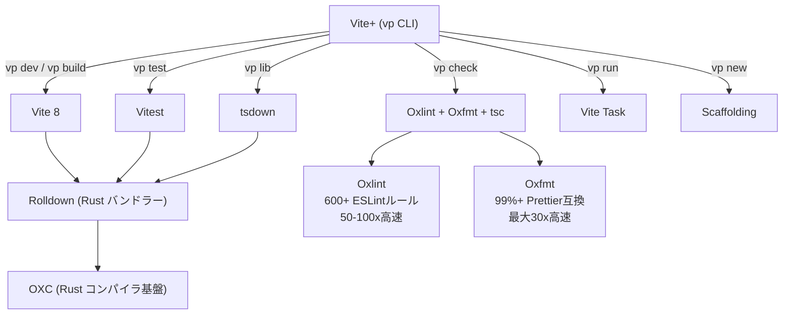

# Vite+ - 統合ツールチェーンとモノレポサポート

## 概要

Vite+（CLI名: `vp`）は VoidZero 社が開発する「The Unified Toolchain for the Web」であり、Vite・Vitest・Rolldown・OXC（Oxlint / Oxfmt）・tsdown・Vite Task を単一のバイナリに統合したWeb開発ツールチェーンである[[1]](#参考リンク)。2026年3月時点でAlpha版がOSSとして公開されており、パブリックプレビューは2026年前半を予定している[[2]](#参考リンク)。

:::info 関連ドキュメント
- [VoidZero エコシステム全体像 - プロダクト・成熟度・言語選定](../voidzero-ecosystem)
- [Vite 8 + Rolldown - Rustベースの次世代ビルドツール](./vite8-rolldown)
- [OXC（The JavaScript Oxidation Compiler）全体像](../oxc/oxc-overview)
- [モノレポ戦略 - Turborepo / Nx によるスケーラブルな開発基盤](../monorepo/monorepo-strategy)
:::

## 背景・動機

フロントエンド開発では、ビルドツール（Vite）、テストフレームワーク（Vitest）、リンター（ESLint）、フォーマッター（Prettier）、パッケージマネージャー、ランタイム管理をそれぞれ独立して設定・管理する必要があった。特にモノレポ環境ではTurborepoやNxなど別途タスクランナーの導入が必須で、ツールの組み合わせと設定の複雑さが大きな課題となっていた。

Vite+はこれらのツールをRust製の統一基盤の上に統合し、ゼロコンフィグに近い体験を提供することで、ツールチェーンの断片化を解消する[[1]](#参考リンク)。

## 調査内容

### アーキテクチャ

Vite+は以下のRust製コンポーネントを統合した単一バイナリとして提供される[[1]](#参考リンク)[[2]](#参考リンク):



すべてのOSSコンポーネント（Vite、Vitest、Rolldown、OXC）はMITライセンスで永久に公開される[[1]](#参考リンク)。

### CLIコマンド体系

Vite+はCLI名 `vp` で以下のコマンドを提供する[[3]](#参考リンク):

| コマンド | 機能 | 対応する従来ツール |
|---------|------|-------------------|
| `vp new` | プロジェクト・モノレポのスキャフォールディング | `create-vite` / `create-nx-workspace` |
| `vp install` | 依存関係のインストール | `npm install` / `pnpm install` |
| `vp dev` | 開発サーバー起動（HMR対応） | `vite dev` |
| `vp build` | 本番ビルド（webpack比40倍高速） | `vite build` |
| `vp test` | ユニットテスト（Jest互換API） | `vitest` |
| `vp check` | リント + フォーマット + 型チェック | `eslint` + `prettier` + `tsc` |
| `vp lib` | ライブラリバンドル + 型定義生成 | `tsup` / `tsdown` |
| `vp run` | タスク実行（モノレポ対応・キャッシュ内蔵） | `turbo run` / `nx run` |
| `vp env` | ランタイム・パッケージマネージャー管理 | `nvm` / `corepack` |
| `vp ui` | GUIデバッグツール | Vite Devtools |

#### ランタイム・パッケージマネージャー管理

Vite+はNode.jsランタイムの管理も統合し、プロジェクトごとに最適なパッケージマネージャー（pnpm / npm / yarn）を自動選択する[[3]](#参考リンク)。`nvm` や `corepack` の代替として機能する。

#### フレームワーク対応

React、Vue、Svelte、Solid、その他20以上のViteベースフレームワークに対応[[3]](#参考リンク)。メタフレームワーク（Next.js、Nuxt等）はViteプラグイン経由で動作する。

### モノレポサポート（詳細）

Vite+のモノレポサポートは、**Vite Task** というRust製タスクランナーを中核としている[[4]](#参考リンク)。

#### Vite Task の概要

Vite TaskはVite+の `vp run` コマンドを支えるモノレポタスクランナーで、MITライセンスのOSSとして公開されている（[GitHub](https://github.com/voidzero-dev/vite-task)）。主な特徴は以下の通り[[4]](#参考リンク)[[5]](#参考リンク):

- **自動入力トラッキング**: 入力ファイルのフィンガープリントによるキャッシュ判定を自動化。手動でinputs/outputsを設定する必要がない
- **依存関係認識スケジューリング**: `package.json` の依存グラフに基づいてタスク実行順序を自動決定
- **pnpm run互換インターフェース**: 既存のpnpmワークフローからの移行が容易
- **部分タスク分割**: `&&`で連結したコマンドを独立した部分タスクに分割し、各自でキャッシュ管理

#### タスク定義方法

タスクは `package.json` スクリプトと `vite.config.ts` の両方で定義可能[[5]](#参考リンク):

```ts title="vite.config.ts"
import { defineConfig } from 'vite'

export default defineConfig({
  run: {
    tasks: {
      build: {
        command: 'vp build',
        // 依存タスクの指定
        dependsOn: ['lint'],
        // 環境変数の変更でキャッシュ無効化
        env: ['NODE_ENV'],
      },
      lint: {
        command: 'vp check',
        // デフォルトでキャッシュ有効
      },
    },
  },
})
```

`package.json` スクリプトもそのまま実行可能だが、デフォルトではキャッシュが無効。`--cache` フラグで明示的に有効化できる[[5]](#参考リンク):

```bash
# package.json スクリプトをキャッシュ付きで実行
vp run --cache build
```

#### ワークスペース実行オプション

モノレポでの実行を制御する豊富なオプションが用意されている[[5]](#参考リンク):

| フラグ | 機能 | 使用例 |
|--------|------|--------|
| `-r` | 全パッケージで依存順に実行 | `vp run build -r` |
| `-t` | 対象パッケージと推移的依存を実行 | `vp run @my/app#build -t` |
| `--filter` | pnpm互換の選択構文 | `vp run build --filter @my/app...` |
| `-w` | ルートパッケージのみ実行 | `vp run typecheck -w` |

パッケージの実行順序は `package.json` の依存関係グラフから自動的に解決される[[5]](#参考リンク)。

#### キャッシング機構

Vite Taskのキャッシングは「自動入力推論」が最大の特徴である[[4]](#参考リンク):

```text
Turborepo / Nx のアプローチ:
  手動で inputs / outputs を設定 → ハッシュ計算 → キャッシュ判定

Vite Task のアプローチ:
  コマンド実行時に使用されたファイルを自動追跡 → フィンガープリント → キャッシュ判定
```

- `vite.config.ts` で定義されたタスクはデフォルトでキャッシュ有効
- `package.json` スクリプトは `--cache` フラグで有効化
- キャッシュヒット時は出力をキャッシュから再生し、入力変更を検出するとタスクを再実行
- `&&` で連結したコマンド（例: `tsc && vp build`）は独立した部分タスクに分割され、個別にキャッシュされる[[4]](#参考リンク)
- ネストされた `vp run` はプロセス生成ではなくインライン展開で処理され、フラット出力と個別キャッシングを実現

#### プロジェクトスキャフォールディング

`vp new` コマンドでモノレポ構造のプロジェクトを対話的に作成できる[[2]](#参考リンク):

```bash
# 新しいモノレポプロジェクトの作成
vp new my-monorepo

# 既存モノレポへのパッケージ追加
vp new --add-package packages/ui
```

### Turborepo / Nx との比較

Vite+ のモノレポサポート（Vite Task）と既存のモノレポツールの比較:

#### 機能比較

| 機能 | Vite+ (Vite Task) | Turborepo | Nx |
|------|-------------------|-----------|-----|
| **タスクキャッシュ** | 自動入力推論 | 手動inputs/outputs設定 | 手動inputs/outputs設定 |
| **依存グラフ** | package.json自動解析 | turbo.json + package.json | nx.json + project.json |
| **リモートキャッシュ** | 未提供（Alpha段階） | Vercel無料提供 | Nx Cloud（有料）/ セルフホスト[[8]](#参考リンク) |
| **CI分散実行** | なし | なし | Nx Agents[[8]](#参考リンク) |
| **コード生成** | `vp new`（モノレポ向け） | なし | ジェネレーター内蔵 |
| **モジュール境界管理** | なし | なし | ESLintルールで強制可能 |
| **affected検出** | なし | なし | `nx affected` |
| **ビルドツール統合** | 完全統合（Vite内蔵） | 独立（Vite等と併用） | プラグイン経由（@nx/vite） |
| **リント・フォーマット** | 内蔵（Oxlint / Oxfmt） | 外部ツール | 外部ツール |
| **テスト** | 内蔵（Vitest） | 外部ツール | プラグイン（@nx/vitest） |
| **設定の複雑さ** | ゼロコンフィグ志向 | シンプル（turbo.json） | 中〜高（nx.json + plugins） |
| **実装言語** | Rust | Rust | 一部Rust移行中 |

#### 設計思想の違い

```text
Turborepo: 「高速タスクランナー」
  → 既存ツールチェーンの上にキャッシュ・並列実行レイヤーを追加
  → 既存モノレポに10分で導入可能[[6]](#参考リンク)

Nx: 「Build Intelligence Platform」
  → タスク実行に加え、コード生成・モジュール境界・CI分散実行を包括的に提供
  → 大規模プロジェクトで7倍以上の性能差[[6]](#参考リンク)

Vite+: 「統合ツールチェーン」
  → ビルド・テスト・リント・フォーマット・タスク実行をすべて統合
  → ツールチェーンの断片化そのものを解消
```

#### Nx との共存・相性

Vite+とNxは競合する部分もあるが、補完的に使える可能性がある:

**共存可能なシナリオ:**
- Nx のプラグインシステム（`@nx/vite`）は Vite をビルドツールとして統合しており、Vite 8 への対応も進んでいる[[7]](#参考リンク)
- Nx のモジュール境界管理・affected検出・CI分散実行はVite+にない機能であり、大規模プロジェクトではNxのこれらの機能が依然として有用
- `nxViteTsPaths()` プラグインを使えば、NxモノレポでViteのTypeScript paths解決を適切に処理できる[[7]](#参考リンク)

**競合するシナリオ:**
- タスクランナー機能（`vp run` vs `nx run`）は直接競合する
- キャッシュ機構が二重になり、管理が複雑化する可能性がある
- Vite+のゼロコンフィグ志向とNxのプラグイン設定スタイルは設計思想が異なる

**推奨される使い分け:**

| シナリオ | 推奨 |
|---------|------|
| 新規小〜中規模モノレポ | Vite+単体（ゼロコンフィグで最速） |
| 新規大規模モノレポ | Nx + Vite 8（affected検出・CI分散が必要） |
| 既存Nxプロジェクト | Nx + @nx/vite（Vite 8にアップグレード） |
| 既存Turborepoプロジェクト | Turborepo継続 or Vite+移行を段階的に検討 |
| 多言語モノレポ（JS + Go等） | Nx（多言語サポートがある唯一の選択肢） |

### パフォーマンス

Vite+ Alpha での計測値[[2]](#参考リンク):

| ツール | 従来ツール | Vite+搭載ツール | 高速化 |
|--------|-----------|----------------|--------|
| ビルド | webpack | Rolldown | **40倍** |
| ビルド（Vite 7比） | Vite 7 | Vite 8 | **1.6〜7.7倍** |
| リント | ESLint | Oxlint | **50〜100倍** |
| フォーマット | Prettier | Oxfmt | **最大30倍** |

### ライセンスと価格モデル

Vite+のライセンス戦略は以下の通り[[1]](#参考リンク):

- **OSSコンポーネント**（Vite, Vitest, Rolldown, OXC）: MITライセンス、永久無料
- **Vite+ CLI**: MITライセンスでOSS化
- **個人・OSS・小規模事業**: 無料
- **スタートアップ・企業**: 段階的価格設定を予定

### 導入実績

Framer、Atlassianなどの大手企業でVoidZeroエコシステムの採用実績がある[[1]](#参考リンク)。

## 検証結果

### Vite+ のインストールと基本操作

```bash title="Vite+ のインストール"
# Vite+ CLI のインストール
npm install -g vite-plus

# 新しいプロジェクトの作成
vp new my-app
cd my-app

# 開発サーバーの起動
vp dev

# ビルド
vp build

# テスト実行
vp test

# リント・フォーマット・型チェックを一括実行
vp check
```

### モノレポでのタスク実行例

```bash title="モノレポでの基本操作"
# モノレポの新規作成
vp new my-monorepo --monorepo

# 全パッケージのビルド（依存順）
vp run build -r

# 特定パッケージとその依存をビルド
vp run @myorg/web#build -t

# pnpm互換のフィルタ構文
vp run build --filter @myorg/web...

# キャッシュ付きでスクリプト実行
vp run --cache test

# 詳細サマリーの表示
vp run build -r -v
```

### vite.config.ts でのタスク定義

```ts title="vite.config.ts"
import { defineConfig } from 'vite'
import react from '@vitejs/plugin-react'

export default defineConfig({
  plugins: [react()],

  // タスクランナー設定
  run: {
    tasks: {
      // ビルドタスク: lint完了後に実行、NODE_ENVの変更でキャッシュ無効化
      build: {
        command: 'vp build',
        dependsOn: ['lint'],
        env: ['NODE_ENV'],
      },
      // リントタスク: デフォルトでキャッシュ有効
      lint: {
        command: 'vp check',
      },
      // テストタスク: ビルド完了後に実行
      test: {
        command: 'vp test',
        dependsOn: ['build'],
      },
    },
  },
})
```

## まとめ

### Vite+ の位置づけ

Vite+はフロントエンドツールチェーンの「統合」を目指す意欲的なプロジェクトである。従来はVite + Vitest + ESLint + Prettier + Turborepo/Nx という複数ツールの組み合わせが必要だったが、Vite+はこれらを単一のCLIに統合する。

### モノレポサポートの評価

- **強み**: 自動入力推論によるゼロコンフィグキャッシュは、Turborepo/Nxの手動設定と比較して明確なDX向上。ビルドツールとタスクランナーが統合されているため、設定の一貫性も高い
- **課題**: Alpha段階であり、リモートキャッシュ・CI分散実行・affected検出・モジュール境界管理といった大規模モノレポ向け機能がまだない。これらが必要なプロジェクトでは引き続きNxが必要

### 導入判断のポイント

- **今すぐ採用を検討**: 新規の小〜中規模プロジェクトで、ツールチェーンをシンプルにしたい場合
- **動向を注視**: 大規模モノレポで、リモートキャッシュやCI分散実行が必須の場合（Nx/Turborepoを継続しつつ、Vite 8への更新を先行）
- **既存プロジェクトでは**: まずVite 8へのアップグレードを実施し、Vite+の安定化を待って段階的に移行を検討するのが現実的

## 参考リンク

1. [Announcing Vite+ - VoidZero](https://voidzero.dev/posts/announcing-vite-plus)
2. [Announcing Vite+ Alpha - VoidZero](https://voidzero.dev/posts/announcing-vite-plus-alpha)
3. [Vite+ 公式サイト](https://viteplus.dev/)
4. [Vite Task - GitHub](https://github.com/voidzero-dev/vite-task)
5. [Run | Vite+ Guide](https://viteplus.dev/guide/run)
6. [Turborepo, Nx, and Lerna: The Truth about Monorepo Tooling in 2026 - DEV Community](https://dev.to/dataformathub/turborepo-nx-and-lerna-the-truth-about-monorepo-tooling-in-2026-71)
7. [Vite Plugin for Nx - Nx公式ドキュメント](https://nx.dev/docs/technologies/build-tools/vite/introduction)
8. [Distribute Task Execution (Nx Agents) - Nx](https://nx.dev/docs/features/ci-features/distribute-task-execution)
9. [Vite+ GitHub リポジトリ](https://github.com/voidzero-dev/vite-plus)
