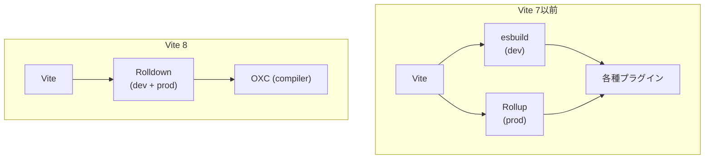
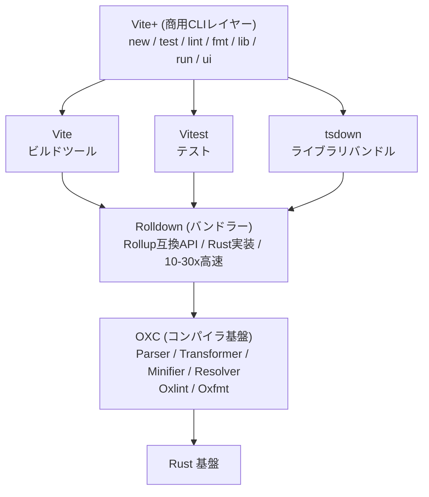

# Vite 8 + Rolldown - Rustベースの次世代ビルドツール

## 概要

Vite 8（2026年3月時点ベータ版）はバンドラーをesbuild + RollupからRust製のRolldownに統一した次世代ビルドツールである。

:::info 関連ドキュメント
- [Vite と React Server Components - @vitejs/plugin-rsc の仕組みと意義](./vite-plugin-rsc)
:::本ドキュメントではアーキテクチャ変更、パフォーマンス改善、Environment API、移行方法、VoidZeroエコシステムの全体像を調査した。

## 背景・動機

Viteは長らくesbuild（依存関係プリバンドル用）とRollup（本番ビルド用）という2つのバンドラーを併用してきた。この構成には以下の課題があった：

- **開発と本番の不整合**: esbuildとRollupで変換結果が微妙に異なり、開発時に正常動作するコードが本番で壊れるケースがあった
- **パフォーマンスの限界**: RollupはJavaScript製であり、大規模プロジェクトのビルドに時間がかかっていた
- **プラグインの二重管理**: esbuildプラグインとRollupプラグインの両方を意識する必要があった

VoidZero社が開発するRolldownは、この課題をRust製の単一バンドラーで解決する[[1]](#参考リンク)。OXCのParser・Transformer・Minifier・Resolverを内部で使用しており、VoidZeroエコシステムの中核を担う（OXCの詳細は[OXC全体像](https://shoota.github.io/research-tech/docs/dev-tools/oxc/oxc-overview)を参照）。

## 調査内容

### アーキテクチャ変更: esbuild + Rollup → Rolldown

Vite 8における最大の変更は、バンドラーの統一である[[1]](#参考リンク)。



**統一による利点:**

- **単一バンドラー**: 開発と本番で同じバンドラーを使うため、変換結果の不整合がなくなる
- **Rust性能**: Rolldownは10〜30倍Rollupより高速で、esbuildと同等の速度を実現[[2]](#参考リンク)
- **OXC統合**: TypeScript/JSX変換、ミニファイ、モジュール解決がすべてOXC経由で処理される
- **Rollupプラグイン互換**: 既存のRollupプラグインの大半がそのまま動作する

### Rolldownの仕組み

RolldownはRollup互換APIを持つRust製バンドラーである。2026年1月にRC（Release Candidate）に到達した[[2]](#参考リンク)。

**主要な特徴:**

- **ネイティブCJS/ESM相互運用**: `@rollup/plugin-commonjs`が不要になり、CommonJSモジュールをネイティブに処理する
- **組み込みNode.jsモジュール解決**: `@rollup/plugin-node-resolve`が不要になる
- **高度なチャンク分割**: `output.advancedChunks`による柔軟なコード分割
- **WASM対応**: プラットフォームを問わず動作するWASMビルドも提供

**パフォーマンス最適化の内訳（RC版での109のパフォーマンスコミット）[[2]](#参考リンク):**

- SIMD JSONエスケープ処理
- 並列チャンク生成
- 最適化されたシンボルリネーム
- 高速ソースマップ処理

**テスト互換性:**

- 900以上のRollupテストをパス
- 670以上のesbuildテストをパス

### Environment API

Environment APIはVite 6で導入され、Vite 8でも引き続き利用可能なランタイム環境の抽象化機構である[[3]](#参考リンク)。

**従来の課題:**

Vite 5まではclient（ブラウザ）とssr（Node.js）の2つの暗黙的な環境しかなく、Edge Workersなど多様なランタイムへの対応が困難だった。

**Environment APIの解決策:**

単一のVite開発サーバーが複数の環境で同時にコードを実行できるようになった。各環境は独立したモジュールグラフを持ち、HMRも環境ごとに独立して動作する。

```ts title="vite.config.ts"
import { defineConfig } from 'vite'

export default defineConfig({
  // 共通設定
  build: {
    sourcemap: true,
  },
  // 環境ごとの設定
  environments: {
    // ブラウザ環境（暗黙のclient環境）
    client: {
      build: {
        outDir: 'dist/client',
      },
    },
    // Node.jsサーバー環境
    server: {
      build: {
        outDir: 'dist/server',
        ssr: true,
      },
    },
    // Edge Worker環境
    edge: {
      resolve: {
        // Edge環境ではすべての依存をバンドルに含める
        noExternal: true,
      },
      build: {
        outDir: 'dist/edge',
        ssr: true,
      },
    },
  },
})
```

**主なユースケース:**

| パターン | 環境構成 |
|---------|---------|
| SPA/MPA | `client`のみ |
| SSRアプリ | `client` + `server`（Node.js） |
| Edge対応 | `client` + `server` + `edge`（Cloudflare Workers等） |
| RSC対応 | `client` + `server` + `rsc` |

### パフォーマンスベンチマーク

実プロジェクトでの改善実績が公開されている[[1]](#参考リンク)：

| プロジェクト | 改善前 | 改善後 | 改善率 |
|-------------|--------|--------|--------|
| Linear | 46秒 | 6秒 | **87%削減** |
| Ramp | - | - | **57%削減** |
| Mercedes-Benz.io | - | - | **38%削減** |
| Beehiiv | - | - | **64%削減** |

**Full Bundle Mode（実験的機能）の予測値[[4]](#参考リンク):**

- 開発サーバー起動が3倍高速化
- フルリロードが40%高速化
- ネットワークリクエスト数が10分の1に削減

Full Bundle Modeは従来のアンバンドル方式（各モジュールを個別にフェッチ）に代わり、開発時もバンドルを行うことで大規模アプリのパフォーマンスを改善する。

### Vite 7からの移行ガイド

#### インストール方法

**方法1: Vite 8に直接アップグレード**

```json title="package.json"
{
  "devDependencies": {
    "vite": "^8.0.0"
  }
}
```

**方法2: rolldown-viteで段階的に移行（推奨）**

```json title="package.json"
{
  "devDependencies": {
    "vite": "npm:rolldown-vite@latest"
  }
}
```

フレームワーク利用時はoverridesも必要:

```json title="package.json（pnpm使用時）"
{
  "pnpm": {
    "overrides": {
      "vite": "npm:rolldown-vite@latest"
    }
  }
}
```

#### 主要な破壊的変更[[5]](#参考リンク)

**1. esbuild設定 → oxc設定への移行**

```ts title="vite.config.ts（変更前）"
export default defineConfig({
  esbuild: {
    jsx: 'automatic',
    define: {
      __DEV__: 'true',
    },
  },
})
```

```ts title="vite.config.ts（変更後）"
export default defineConfig({
  oxc: {
    jsx: 'automatic',
    define: {
      __DEV__: 'true',
    },
  },
})
```

**2. rollupOptions → rolldownOptionsへの移行**

```ts title="vite.config.ts（変更前）"
export default defineConfig({
  build: {
    rollupOptions: {
      output: {
        manualChunks(id) {
          if (/\/react(?:-dom)?/.test(id)) {
            return 'vendor'
          }
        },
      },
    },
  },
})
```

```ts title="vite.config.ts（変更後）"
export default defineConfig({
  build: {
    rolldownOptions: {
      output: {
        advancedChunks: {
          groups: [
            { name: 'vendor', test: /\/react(?:-dom)?/ },
          ],
        },
      },
    },
  },
})
```

**3. ブラウザターゲットの更新**

| ブラウザ | Vite 7 | Vite 8 |
|---------|--------|--------|
| Chrome | 107 | 111 |
| Edge | 107 | 111 |
| Firefox | 104 | 114 |
| Safari | 16.0 | 16.4 |

**4. CSS ミニファイのデフォルト変更**

JavaScript ミニファイはesbuildからOXC Minifierに、CSSミニファイはesbuildからLightning CSSに変更された。

**5. CommonJS相互運用の変更**

CJSモジュールのインポート動作が変更され、`default`インポートのセマンティクスが厳格化された。一時的に旧動作に戻すには:

```ts title="vite.config.ts"
export default defineConfig({
  legacy: {
    inconsistentCjsInterop: true, // 非推奨: 移行期間のみ使用
  },
})
```

**6. プラグイン作成時の注意**

非JavaScriptコンテンツをJavaScriptに変換するload/transformフックでは、`moduleType: 'js'`の明示が必要になる場合がある:

```ts title="vite-plugin-txt.ts"
const txtPlugin = {
  name: 'txt-loader',
  load(id: string) {
    if (id.endsWith('.txt')) {
      const content = readFileSync(id, 'utf-8')
      return {
        code: `export default ${JSON.stringify(content)}`,
        moduleType: 'js', // Rolldownでは明示が必要
      }
    }
  },
}
```

#### rolldown-viteの検出方法

プラグイン内でRolldown環境かどうかを判定する方法:

```ts title="vite-plugin-example.ts"
import * as vite from 'vite'

// モジュールレベルでの判定
if (vite.rolldownVersion) {
  console.log('rolldown-vite を使用中')
}

// プラグインフック内での判定
const myPlugin = {
  name: 'my-plugin',
  resolveId() {
    if (this.meta.rolldownVersion) {
      // Rolldown固有のロジック
    }
  },
}
```

### Vite+の構想と展望

Vite+はVoidZero社が開発する商用CLIツールで、Viteの上位互換として機能する[[6]](#参考リンク)。

**提供コマンド:**

| コマンド | 機能 | ベース技術 |
|---------|------|-----------|
| `vite new` | プロジェクトスキャフォールディング | - |
| `vite test` | ユニットテスト | Vitest |
| `vite lint` | リント（ESLintの100倍高速） | Oxlint |
| `vite fmt` | フォーマット（Prettier互換） | Oxfmt |
| `vite lib` | ライブラリバンドル + DTS生成 | tsdown / Rolldown |
| `vite run` | モノレポタスクランナー | - |
| `vite ui` | GUIデバッグツール | - |

Vite+はMITライセンスのOSSプロジェクト（Vite, Vitest, Rolldown, OXC）の上に構築された商用レイヤーであり、OSSプロジェクト自体は永久にMITライセンスを維持する。パブリックプレビューは2026年前半を予定している[[6]](#参考リンク)。

### VoidZeroエコシステム全体像

VoidZero社が推進するJavaScriptツールチェーンの全体構造:



すべてのOSSコンポーネント（Vite, Vitest, Rolldown, OXC）はMITライセンスで永久に公開される[[6]](#参考リンク)。

## 検証結果

### rolldown-viteの導入テスト

Viteプロジェクトでのrolldown-vite導入手順を検証する。

```bash title="新規プロジェクトでの検証"
# プロジェクト作成
npm create vite@latest my-app -- --template react-ts
cd my-app

# rolldown-viteに切り替え
npm pkg set devDependencies.vite="npm:rolldown-vite@latest"
npm install

# 開発サーバー起動
npm run dev

# 本番ビルド
npm run build
```

### vite.config.tsの設定例

```ts title="vite.config.ts"
import { defineConfig, withFilter } from 'vite'
import react from '@vitejs/plugin-react'

export default defineConfig({
  plugins: [
    react(), // v5.0.0+でOXCのReact Refresh変換を自動使用
  ],

  // OXCによるTypeScript/JSX変換設定
  oxc: {
    jsx: 'automatic',
  },

  // tsconfig pathsの自動解決（Vite 8新機能）
  resolve: {
    tsconfigPaths: true,
  },

  build: {
    // Rolldown固有オプション
    rolldownOptions: {
      output: {
        // advancedChunksによる柔軟なチャンク分割
        advancedChunks: {
          groups: [
            {
              name: 'vendor',
              test: /[\\/]node_modules[\\/](react|react-dom)[\\/]/,
            },
            {
              name: 'utils',
              test: /[\\/]src[\\/]utils[\\/]/,
            },
          ],
        },
      },
    },
  },
})
```

### withFilterによるプラグイン最適化

Rust-JavaScript間の通信オーバーヘッドを削減するユーティリティ:

```ts title="vite.config.ts"
import { defineConfig, withFilter } from 'vite'
import svgr from 'vite-plugin-svgr'

export default defineConfig({
  plugins: [
    // SVGファイルのみにプラグインを適用し、不要な通信を削減
    withFilter(
      svgr({}),
      {
        load: { id: /\.svg\?react$/ },
      }
    ),
  ],
})
```

### ネイティブプラグインの有効化

Vite 8ではalias解決とモジュール解決のネイティブプラグイン（Rust実装）がデフォルトで有効になっている[[4]](#参考リンク)。問題が発生した場合は段階的に無効化できる:

```ts title="vite.config.ts"
export default defineConfig({
  experimental: {
    // 'v1': 全ネイティブプラグイン有効（デフォルト）
    // 'resolver': リゾルバーのみ有効
    // false: すべて無効
    enableNativePlugin: 'v1',
  },
})
```

## まとめ

Vite 8 + Rolldownは、Viteの長年の課題であったesbuild/Rollupの二重バンドラー構成を解消し、Rust製の統一バンドラーによるパフォーマンスと一貫性の両立を実現した。

**導入判断のポイント:**

- **積極的に採用すべき場合**: ビルド時間がボトルネックのプロジェクト（Linear社の46秒→6秒の事例が示す通り、大規模プロジェクトほど恩恵が大きい）
- **慎重に検討すべき場合**: esbuild固有のオプションやRollupプラグインに深く依存しているプロジェクト、ネイティブデコレーターを使用しているプロジェクト（OXC Transformerが未対応）
- **rolldown-viteでの段階的移行が推奨**: Vite 8正式版を待たず、既存プロジェクトでrolldown-viteパッケージを使って互換性を検証できる

VoidZeroエコシステム全体として、OXC（[詳細ドキュメント](https://shoota.github.io/research-tech/docs/dev-tools/oxc/oxc-overview)）を基盤にRolldown → Vite → Vite+と積み上げる構造が明確になっており、Rust製ツールチェーンへの移行トレンドは今後さらに加速すると予想される。

## 参考リンク

1. [Vite 8 Beta: The Rolldown-powered Vite - Vite公式ブログ](https://vite.dev/blog/announcing-vite8-beta)
2. [Announcing Rolldown 1.0 RC - VoidZero](https://voidzero.dev/posts/announcing-rolldown-rc)
3. [Environment API - Vite公式ドキュメント](https://vite.dev/guide/api-environment)
4. [Rolldown Integration - Vite公式ドキュメント](https://vite.dev/guide/rolldown)
5. [Migration from v7 - Vite公式ドキュメント](https://main.vite.dev/guide/migration)
6. [Announcing Vite+ - VoidZero](https://voidzero.dev/posts/announcing-vite-plus)
7. [Rolldown GitHub リポジトリ](https://github.com/rolldown/rolldown)
8. [VoidZero公式サイト](https://voidzero.dev/)
