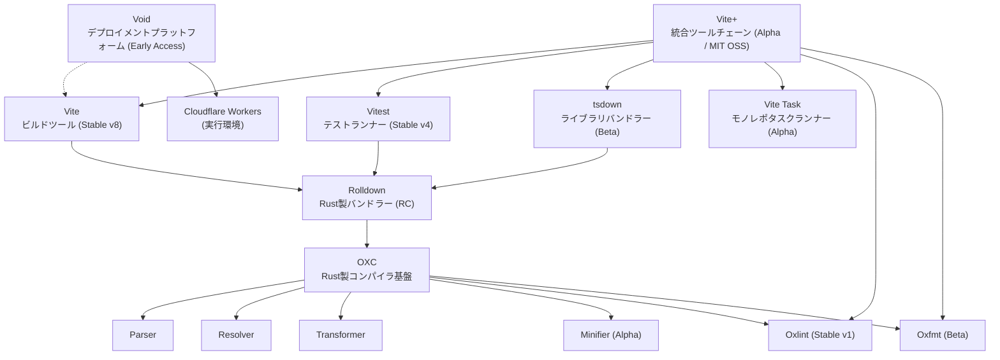

# VoidZero エコシステム全体像 - プロダクト・成熟度・言語選定

## 概要

VoidZero（void(0)）は、Vite の作者 Evan You が2023年に設立した「The JavaScript Tooling Company」であり、JavaScript/TypeScript 開発者の生産性を劇的に向上させることをミッションとする[[1]](#参考リンク)。Vite・Vitest・Rolldown・OXC を中核に、Rust 製の統一ツールチェーンを構築している。

本ドキュメントでは、VoidZero の全プロダクトの概要・相互関係・成熟度・技術選定の観点を俯瞰する。

:::info 関連ドキュメント
- [Vite 8 + Rolldown - Rustベースの次世代ビルドツール](./vite/vite8-rolldown)
- [Vite+ - 統合ツールチェーンとモノレポサポート](./vite/vite-plus)
- [OXC（The JavaScript Oxidation Compiler）全体像](./oxc/oxc-overview)
:::

## 背景・動機

JavaScript/TypeScript のフロントエンド開発では、ビルドツール・テストフレームワーク・リンター・フォーマッター・パッケージマネージャー・タスクランナーをそれぞれ個別に選定・設定する必要があり、ツールチェーンの断片化が長年の課題となってきた。各ツール間での設定の重複や非互換性、パフォーマンスのボトルネック（JavaScript 製ツールの速度限界）が開発者体験を損なっていた。

VoidZero はこの問題を、Rust を活用した高性能な基盤コンポーネント群と、それらを統合する上位レイヤー（Vite+）によって解決しようとしている。

## 調査内容

### 会社概要

| 項目 | 内容 |
|------|------|
| **社名** | VoidZero Inc. |
| **設立** | 2023年 |
| **創業者/CEO** | Evan You（Vue.js、Vite の作者） |
| **従業員数** | 約17名（グローバルリモート） |
| **Seed資金調達** | $4.6M（2024年、Accel リード）[[2]](#参考リンク) |
| **Series A資金調達** | $12.5M（2025年10月、Accel リード、Peak XV Partners 等参加）[[3]](#参考リンク) |
| **ミッション** | JavaScript 開発者の生産性を劇的に向上させる |

### プロダクト全体像

VoidZero のプロダクトは、低レイヤーの Rust 製コンパイラ基盤から上位の統合ツールチェーンまで、階層的に構成されている。



### 各プロダクトの詳細

#### 1. OXC（The JavaScript Oxidation Compiler）

Rust で構築された JavaScript/TypeScript 向け高性能コンパイラツールチェーン。VoidZero エコシステム全体の最下層基盤[[4]](#参考リンク)。

| コンポーネント | 説明 | 成熟度 | パフォーマンス |
|---------------|------|--------|---------------|
| **Parser** | JS/TS パーサー | Stable | SWC比 3倍高速 |
| **Resolver** | モジュール解決 | Stable | enhanced-resolve比 28倍高速 |
| **Transformer** | JS/TS/JSX 変換（Babel代替） | Milestone 3 | Babel比 40倍高速 |
| **Minifier** | コード圧縮（Terser代替） | Alpha | Terser同等圧縮率で大幅高速 |
| **Oxlint** | リンター（ESLint代替） | **Stable v1** | ESLint比 50〜100倍高速 |
| **Oxfmt** | フォーマッター（Prettier代替） | **Beta** | Prettier比 最大36倍高速 |

**Oxlint** は2025年6月に v1.0 安定版をリリースし、650以上のルールを実装[[5]](#参考リンク)。2026年3月には JavaScript プラグイン（Alpha）もリリースされ、既存の ESLint プラグインを Rust 速度で実行可能になった[[6]](#参考リンク)。

**Oxfmt** は2026年2月にBeta版に到達し、Prettier の JavaScript/TypeScript 準拠テストを100%パス[[7]](#参考リンク)。JS/TS/JSON/YAML/HTML/CSS/Markdown/Vue/Angular 等、20以上のフォーマットに対応する。

詳細は [OXC全体像](./oxc/oxc-overview) を参照。

#### 2. Rolldown

Rust 製の高速バンドラー。Rollup 互換 API を持ち、esbuild 同等のパフォーマンスを実現する[[8]](#参考リンク)。

| 項目 | 内容 |
|------|------|
| **成熟度** | RC（2026年1月リリース） |
| **パフォーマンス** | Rollup比 10〜30倍高速 |
| **互換性** | Rollup テスト 900+パス、esbuild テスト 670+パス |
| **GitHub Stars** | 13.1k |
| **特徴** | ネイティブ CJS/ESM 相互運用、SIMD最適化、並列チャンク生成 |
| **利用先** | Vite 8 のデフォルトバンドラー |

RC 版以降、安定リリース（1.0）まで破壊的変更は行わない方針[[8]](#参考リンク)。OXC の Parser・Transformer・Minifier・Resolver を内部で使用する。

詳細は [Vite 8 + Rolldown](./vite/vite8-rolldown) を参照。

#### 3. Vite

Web アプリケーションのビルドツール。SPA のデファクトスタンダードであり、TanStack Start・Nuxt・SvelteKit 等のフルスタックフレームワークの基盤[[9]](#参考リンク)。

| 項目 | 内容 |
|------|------|
| **成熟度** | **Stable v8**（2026年3月12日リリース） |
| **GitHub Stars** | 79.0k |
| **Contributors** | 1,245人 |
| **主な変更（v8）** | esbuild + Rollup → Rolldown に統一 |
| **パフォーマンス** | Linear社: 46秒→6秒（87%削減） |

Vite 8 は Vite 2 以来最大のアーキテクチャ変更であり、開発・本番のバンドラーを Rolldown に統一した。Environment API によりブラウザ・Node.js・Edge Workers（Cloudflare Workers 等）を単一設定で管理可能[[9]](#参考リンク)。

#### 4. Vitest

Vite ネイティブなテストランナー。Jest 互換 API を持ち、TypeScript/ESM をゼロコンフィグで実行する[[10]](#参考リンク)。

| 項目 | 内容 |
|------|------|
| **成熟度** | **Stable v4** |
| **GitHub Stars** | 16.1k |
| **npm週間DL** | 約17M |
| **主な機能** | Browser Mode（Stable）、Visual Regression Testing、Playwright Trace |

Angular 21 が Vitest を公式テストランナーとして採用するなど、エコシステムでの採用が急速に拡大している[[10]](#参考リンク)。

#### 5. tsdown

TypeScript ライブラリ向けバンドラー。Rolldown を基盤とし、ベストプラクティスを組み込んだライブラリビルドツール[[11]](#参考リンク)。

| 項目 | 内容 |
|------|------|
| **成熟度** | Beta |
| **位置づけ** | tsup の後継。Vite+ の `vp lib` コマンドの基盤 |
| **特徴** | バンドルと型定義生成を単一ツールで処理、`--exe` フラグで Node.js 単一実行ファイル化（実験的） |
| **採用事例** | Vue Router、Better-Auth、TresJS |

2025年 JavaScript Rising Stars のToolingカテゴリで10位にランクイン[[11]](#参考リンク)。

#### 6. Vite Task

Vite+ に組み込まれたモノレポタスクランナー[[12]](#参考リンク)。

| 項目 | 内容 |
|------|------|
| **成熟度** | Alpha（Vite+ の一部として提供） |
| **特徴** | 自動入力トラッキング（手動の inputs/outputs 設定不要）、依存関係認識スケジューリング、pnpm run 互換 |
| **競合** | Turborepo、Nx |

詳細は [Vite+ - 統合ツールチェーンとモノレポサポート](./vite/vite-plus) を参照。

#### 7. Vite+（統合ツールチェーン）

上記のすべてのプロダクトを統合した「Cargo for JavaScript」[[13]](#参考リンク)。

| 項目 | 内容 |
|------|------|
| **成熟度** | **Alpha**（MIT OSS） |
| **CLI名** | `vp` |
| **ライセンス** | MIT（当初は商用ライセンス予定だったが、OSS に方針転換）[[14]](#参考リンク) |
| **価格** | 個人・OSS・小規模事業は無料。スタートアップ・企業向けは段階的価格設定を予定 |

主要コマンド: `vp new` / `vp dev` / `vp build` / `vp test` / `vp check` / `vp lib` / `vp run` / `vp ui` / `vp env`

詳細は [Vite+](./vite/vite-plus) を参照。

#### 8. Void（デプロイメントプラットフォーム）

Vite ネイティブなフルスタックデプロイメントプラットフォーム。**Cloudflare のグローバルネットワーク上に構築**されている[[15]](#参考リンク)[[18]](#参考リンク)。

| 項目 | 内容 |
|------|------|
| **成熟度** | Early Access（サインアップ受付中） |
| **実行環境** | Cloudflare Workers（本番）/ Miniflare（ローカル開発） |
| **デプロイ** | `void deploy` コマンドでワンコマンドデプロイ |
| **対応フレームワーク** | React、Vue、Svelte、Solid（フレームワーク非依存） |
| **レンダリング** | SSR、SSG、ISR、Islands（部分ハイドレーション） |
| **公式サイト** | [void.cloud](https://void.cloud/) |

**組み込みサービス:**

- データベース / KV ストレージ / オブジェクトストレージ
- AI 推論
- 認証
- ジョブキュー / スケジュールタスク（Cron）
- Markdown サポート

**特徴的な設計:**

- ソースコードからインフラを自動検出し、設定ファイルやダッシュボード操作なしでリソースをプロビジョニング
- ローカル開発では Miniflare で Workers ランタイムをシミュレートし、本番との環境差異を最小化
- AI エージェント向けのビルトインスキル・MCP サポート・リファレンスプロンプトを提供[[18]](#参考リンク)

Vite 8 → Vite+ → Void と、開発からデプロイまでのフルスタック体験を提供する構想であり、Vercel/Netlify に対する VoidZero の回答と位置付けられる。

:::caution 注意
「Void Editor」（VS Code フォークの AI エディタ）は VoidZero とは無関係の別プロジェクトである。
:::

#### 9. Vite DevTools

モジュールグラフの検査、トランスフォームタイムラインの分析、HMR デバッグ、バンドルサイズ分析を提供する GUI ツール[[16]](#参考リンク)。

| 項目 | 内容 |
|------|------|
| **成熟度** | 実験的（Vite 8 Beta でフラグ付き提供） |
| **開発** | VoidZero と NuxtLabs の共同開発 |
| **アクセス** | `vp ui` コマンド（Vite+）または Vite 8 の実験フラグ |

### プロダクト成熟度一覧

2026年3月時点のステータス:

| プロダクト | 成熟度 | 本番利用 | 備考 |
|-----------|--------|---------|------|
| **Vite** | Stable (v8) | ✅ 推奨 | デファクトスタンダード |
| **Vitest** | Stable (v4) | ✅ 推奨 | Jest からの移行先として成熟 |
| **Oxlint** | Stable (v1) | ✅ 可能 | 小〜中規模で ESLint 完全代替可。大規模は JS プラグイン（Alpha）の成熟待ち |
| **Rolldown** | RC | ⚠️ 条件付き | Vite 8 経由で間接利用は問題なし。単独利用は RC の安定性に注意 |
| **Oxfmt** | Beta | ⚠️ 条件付き | Prettier 100%互換だが Beta。段階的導入を推奨 |
| **tsdown** | Beta | ⚠️ 条件付き | ライブラリビルドの新規採用に適する |
| **OXC Parser** | Stable | ✅ 可能 | Rolldown/Oxlint 経由で広く利用済み |
| **OXC Transformer** | Milestone 3 | ⚠️ 条件付き | Vite 8 経由で間接利用は問題なし |
| **OXC Minifier** | Alpha | ❌ 未推奨 | 本番利用は時期尚早 |
| **Vite+** | Alpha | ❌ 未推奨 | 早期テスターとしての利用。安定化待ち |
| **Vite Task** | Alpha | ❌ 未推奨 | リモートキャッシュ未対応 |
| **Void** | Early Access | ⚠️ 限定的 | Cloudflare Workers ベース。サインアップ受付中 |
| **Vite DevTools** | 実験的 | ❌ デバッグ用 | 開発支援ツールとして利用可 |

### 言語選定とアーキテクチャ

VoidZero のプロダクトは、**Rust** と **TypeScript/JavaScript** のハイブリッド構成を取っている。

#### 使用言語一覧

| プロダクト | 主要言語 | 補助言語 | 理由 |
|-----------|---------|---------|------|
| **OXC** (Parser/Resolver/Transformer/Minifier/Oxlint) | **Rust** | - | CPU集約的な処理（パース・変換・ミニファイ・リント）で最大パフォーマンスが必要 |
| **Oxfmt** | **Rust** | - | フォーマットは全ファイルを高速に処理する必要があり、Rust のメモリ安全性と速度が不可欠 |
| **Rolldown** | **Rust** | JavaScript (プラグインAPI) | バンドル処理のコアはRust、プラグインはJS/Rollup互換API |
| **Vite** | **TypeScript** | - | プラグインエコシステムとの互換性、設定の柔軟性を優先 |
| **Vitest** | **TypeScript** | - | Jest 互換 API の提供、テストコードとの親和性 |
| **tsdown** | **TypeScript** + Rust (Rolldown経由) | - | ユーザー向け API は TS、バンドル処理は Rolldown(Rust) に委譲 |
| **Vite Task** | **Rust** | - | ファイルフィンガープリントやキャッシュ処理の高速化 |
| **Vite+** | **TypeScript** + **Rust** | - | CLI レイヤーは TS、内部処理は各 Rust コンポーネントに委譲 |

#### 言語選定の設計思想

```text
パフォーマンスクリティカル層（Rust）:
  OXC → Rolldown → Vite Task
  ├── CPU集約的: パース、変換、ミニファイ、バンドル、リント、フォーマット
  ├── ネイティブマルチスレッド実行
  ├── SIMD最適化（JSON処理、文字列処理等）
  └── メモリ安全性の保証（GCなし）

ユーザー向けAPI層（TypeScript）:
  Vite → Vitest → Vite+ CLI
  ├── プラグインエコシステムとの互換性
  ├── 設定ファイル（vite.config.ts）の柔軟性
  ├── npm パッケージとしての配布容易性
  └── JS/TS 開発者にとっての馴染みやすさ
```

この「Rust でコア、TypeScript で API」というアーキテクチャは、**パフォーマンスと開発者体験の両立**を実現するための意図的な設計判断である[[17]](#参考リンク)。esbuild（Go製）が示した「ネイティブ言語による高速化」のアプローチを、より広範なツールチェーンに拡張したものと言える。

#### なぜ Go ではなく Rust か

esbuild が Go で成功を収めた一方、VoidZero が Rust を選択した理由:

- **メモリ管理**: Rust はゼロコスト抽象化とオーナーシップシステムにより、GC によるパフォーマンスの揺らぎがない
- **WASM対応**: Rust → WASM コンパイルが容易で、ブラウザ内での実行（Vite DevTools等）に有利
- **エコシステムの潮流**: Biome（旧Rome）、SWC、Lightning CSS 等、JavaScript ツールチェーンの Rust 化が業界トレンドとなっている[[17]](#参考リンク)
- **napi-rs**: Rust から Node.js ネイティブアドオンを生成するエコシステムが成熟しており、JS との相互運用が容易

### プロダクト間の関係性

```text
開発フロー:
  コード編集 → vp check (Oxlint + Oxfmt) → vp dev (Vite 8)
       ↓
  vp test (Vitest) → vp build (Vite 8 + Rolldown)
       ↓
  vp lib (tsdown) → vp run (Vite Task) → Void (デプロイ)

技術スタック:
  ┌──────────────────────────────────────────┐
  │          Vite+ (統合 CLI / Alpha)         │
  ├──────┬──────┬───────┬───────┬────────────┤
  │ Vite │Vitest│tsdown │ViteTask│DevTools   │
  ├──────┴──────┴───────┴───────┴────────────┤
  │            Rolldown (バンドラー / RC)       │
  ├──────────────────────────────────────────┤
  │    OXC (Parser/Resolver/Transformer/      │
  │    Minifier/Oxlint/Oxfmt)                 │
  ├──────────────────────────────────────────┤
  │              Rust 基盤                     │
  └──────────────────────────────────────────┘
```

#### Cloudflare との関係

VoidZero と Cloudflare の関係は2つのレイヤーで存在する:

**1. Void のインフラ基盤としての Cloudflare**

Void デプロイメントプラットフォームは Cloudflare Workers のグローバルネットワーク上に構築されている[[18]](#参考リンク)。ローカル開発では Miniflare（Workers のローカルシミュレーター）を使用し、本番環境は Cloudflare のエッジネットワークで動作する。データベース・KV・オブジェクトストレージ等の組み込みサービスも Cloudflare のインフラ（D1・KV・R2 等）を基盤としていると推測される。

**2. Vite 8 の Environment API による Edge 対応**

Vite 8 の Environment API により、Cloudflare Workers をはじめとする Edge ランタイムをファーストクラスでサポートしている[[9]](#参考リンク)。

```ts title="vite.config.ts - Edge Worker環境の例"
import { defineConfig } from 'vite'

export default defineConfig({
  environments: {
    client: {
      build: { outDir: 'dist/client' },
    },
    // Cloudflare Workers 等の Edge 環境
    edge: {
      resolve: { noExternal: true },
      build: { outDir: 'dist/edge', ssr: true },
    },
  },
})
```

この2層構造により、Vite でビルド → Vite+ で統合管理 → Void (Cloudflare) にデプロイという一貫したワークフローが実現する。

### 技術選定の観点

#### 今すぐ採用を推奨

| プロダクト | 対象 | 理由 |
|-----------|------|------|
| **Vite 8** | 全プロジェクト | Stable。Rolldown統合によりビルド10〜30倍高速化 |
| **Vitest** | テストフレームワーク選定 | Stable。Jest互換で移行容易。ESM/TypeScriptネイティブ |
| **Oxlint** | リント高速化 | Stable v1。ESLint併用（補助リンター）として段階的導入可 |

#### 段階的に導入を検討

| プロダクト | 対象 | 理由 |
|-----------|------|------|
| **Oxfmt** | Prettier 代替 | Beta。100% Prettier互換。速度重視のプロジェクトに |
| **tsdown** | ライブラリ作者 | Beta。新規ライブラリで採用し、既存はtsup継続が無難 |

#### 動向を注視

| プロダクト | 理由 |
|-----------|------|
| **Vite+** | Alpha。安定化・リモートキャッシュ等の機能充実を待つ |
| **Void** | Early Access。Cloudflare Workers ベースの Vercel/Netlify 代替。本番利用には安定化待ち |
| **Vite DevTools** | 実験的。デバッグ用途での試用は有益 |

## 検証結果

### VoidZero エコシステムの段階的導入パス

```bash title="Step 1: Vite 8 へのアップグレード（最も低リスク）"
# package.json を更新
npm install vite@^8.0.0

# 設定の移行（esbuild → oxc, rollupOptions → rolldownOptions）
# 既存の設定は互換レイヤーで自動変換されるが、明示的な移行を推奨
```

```bash title="Step 2: Oxlint の補助リンターとしての導入"
# ESLint と併用し、高速なファーストパスとして利用
npm install -D oxlint

# package.json に追加
# "scripts": { "lint": "oxlint . && eslint ." }
```

```bash title="Step 3: Vitest への移行（Jest からの場合）"
npm install -D vitest

# vitest.config.ts は不要（vite.config.ts の設定を自動共有）
# Jest 互換 API により、テストコードの変更は最小限
```

```bash title="Step 4: Oxfmt の試験導入（Beta安定化後）"
npm install -D oxfmt

# Prettier からの移行
npx oxfmt --migrate prettier

# 99%+ 互換のため差分は最小限
```

```bash title="Step 5: Vite+ への移行（安定化後）"
npm install -g vite-plus

# 既存 Vite プロジェクトをそのまま利用可能
# vp dev / vp build / vp test が即座に動作
```

### 設定の統一例

```ts title="vite.config.ts - VoidZeroエコシステム活用例"
import { defineConfig } from 'vite'
import react from '@vitejs/plugin-react'

export default defineConfig({
  plugins: [react()],

  // OXC による TypeScript/JSX 変換
  oxc: {
    jsx: 'automatic',
  },

  // tsconfig paths 自動解決（Vite 8 新機能）
  resolve: {
    tsconfigPaths: true,
  },

  build: {
    // Rolldown 固有の最適化
    rolldownOptions: {
      output: {
        advancedChunks: {
          groups: [
            { name: 'vendor', test: /[\\/]node_modules[\\/](react|react-dom)[\\/]/ },
          ],
        },
      },
    },
  },
})
```

## まとめ

### VoidZero の戦略

VoidZero は「Rust でコア、TypeScript で API」のハイブリッドアーキテクチャにより、パフォーマンスと開発者体験を両立させている。OXC → Rolldown → Vite → Vite+ という階層構造は、各レイヤーが独立して利用可能であると同時に、統合した際に最大の効果を発揮する設計になっている。

### 現時点での評価

- **成熟した基盤**: Vite（79k stars）・Vitest（16k stars）は既にデファクトスタンダード。本番利用に問題なし
- **急速に成熟するコンポーネント**: Oxlint（Stable）、Rolldown（RC）、Oxfmt（Beta）は実用段階に近づいている
- **将来への投資**: Vite+ は Alpha、Void は Early Access。基盤コンポーネントの成熟に伴い、開発→デプロイの統合体験が現実味を帯びている
- **OSS コミットメント**: 当初商用ライセンスを予定していた Vite+ を MIT で OSS 化する判断は、エコシステムへの強いコミットメントを示している

### リスク要因

- Vite+ の安定化までは、既存のツール（ESLint + Prettier + Turborepo/Nx）との併用が現実的
- Rolldown は RC だが Vite 8 経由での間接利用は十分安定している（Linear 等の大規模プロダクションで実証済み）
- OXC Minifier が Alpha であるため、ミニファイの品質・圧縮率に関しては今後の改善に注目

## 参考リンク

1. [VoidZero 公式サイト](https://voidzero.dev/)
2. [Our Seed Investment in VoidZero - Accel](https://www.accel.com/noteworthies/our-seed-investment-in-voidzero-evan-yous-bold-vision-for-javascript-tooling)
3. [VoidZero Raises $12.5M Series A - VoidZero](https://voidzero.dev/posts/announcing-series-a)
4. [OXC 公式サイト](https://oxc.rs/)
5. [Announcing Oxlint 1.0 - VoidZero](https://voidzero.dev/posts/announcing-oxlint-1-stable)
6. [Oxlint JS Plugins Alpha - OXC](https://oxc.rs/blog/2026-03-11-oxlint-js-plugins-alpha)
7. [Oxfmt Beta - OXC](https://oxc.rs/blog/2026-02-24-oxfmt-beta)
8. [Announcing Rolldown 1.0 RC - VoidZero](https://voidzero.dev/posts/announcing-rolldown-rc)
9. [Vite 8.0 is out! - Vite公式ブログ](https://vite.dev/blog/announcing-vite8)
10. [Announcing Vitest 4.0 - VoidZero](https://voidzero.dev/posts/announcing-vitest-4)
11. [What's New in ViteLand: November 2025 Recap - VoidZero](https://voidzero.dev/posts/whats-new-nov-2025)
12. [Vite Task - GitHub](https://github.com/voidzero-dev/vite-task)
13. [Announcing Vite+ - VoidZero](https://voidzero.dev/posts/announcing-vite-plus)
14. [Announcing Vite+ Alpha - VoidZero](https://voidzero.dev/posts/announcing-vite-plus-alpha)
15. [Everything You Need to Know about Vite 8, Vite+, and Void - Builder.io](https://www.builder.io/blog/vite-8-vite-plus-void)
16. [VoidZero and NuxtLabs join forces on Vite Devtools - VoidZero](https://voidzero.dev/posts/voidzero-nuxtlabs-vite-devtools)
17. [Vite+ Unveiled with Unified Toolchain and Rust Powered Core - InfoQ](https://www.infoq.com/news/2025/10/vite-plus-unveiled/)
18. [Void - Vite-native deployment platform](https://void.cloud/)
