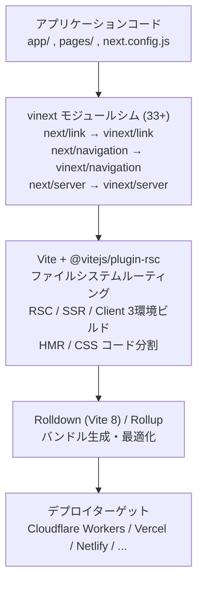

# vinext - Next.js API を Vite 上に再実装した実験的フレームワーク

## 概要

vinext は Cloudflare が開発した実験的フレームワークで、Next.js の API サーフェスを Vite 上に再実装したものである。Next.js のビルドアウトプットをアダプトする OpenNext とは異なり、`next/*` インポートを 33 個以上のシムモジュールで差し替え、Vite のビルドパイプラインで直接ビルドする。Next.js 16 比で**ビルド 4.4 倍高速**、**バンドルサイズ 57% 削減**を達成し、Cloudflare Workers へのワンコマンドデプロイを実現する[[1]](#参考リンク)。

:::info 関連ドキュメント
- [Next.js 15/16 App Router 設計パターン](../react/nextjs15-app-router)
- [Vite と React Server Components - @vitejs/plugin-rsc の仕組みと意義](../dev-tools/vite/vite-plugin-rsc)
- [Vite 8 + Rolldown - Rustベースの次世代ビルドツール](../dev-tools/vite/vite8-rolldown)
- [Hono - Web Standards ベースの超軽量マルチランタイムWebフレームワーク](../frameworks/hono) - Cloudflare Workers 上の別アプローチ
:::

## 背景・動機

Next.js はフロントエンドのフルスタックフレームワークとして広く採用されているが、以下の構造的な課題がある:

- **Vercel 以外へのデプロイが困難**: Next.js は Vercel のインフラに最適化されており、Cloudflare Workers や AWS Lambda への展開には OpenNext 等のアダプターが必要
- **OpenNext の脆弱性**: OpenNext は Next.js のビルド出力を変換するアプローチであり、「Next.js のアウトプットを基盤にすることは困難で脆弱なアプローチ」であると Cloudflare は指摘している[[1]](#参考リンク)
- **開発時のランタイム制約**: アダプター方式ではビルド・デプロイのみ対応可能だが、開発中は Node.js に制限され、Durable Objects や KV といったプラットフォーム固有 API を直接使えない
- **ビルドツールのロックイン**: Next.js は独自の Turbopack ツールチェインに依存しており、Vite エコシステムのプラグインや最適化の恩恵を受けられない

vinext はこれらの問題に対し、Next.js の API を Vite 上にクリーン実装することで解決を試みる。

## 調査内容

### 1. コンセプト: API サーフェスの再実装

vinext の中核的なアイデアは「**Next.js のフレームワークコードを使わず、API の互換性のみを再現する**」ことにある。

#### OpenNext との根本的な違い

| 観点 | OpenNext | vinext |
|---|---|---|
| **アプローチ** | Next.js のビルド出力を変換 | Next.js の API を Vite 上に再実装 |
| **ビルドツール** | Next.js（Turbopack）でビルド後に変換 | Vite（Rolldown）で直接ビルド |
| **開発サーバー** | Node.js のみ | プラットフォームネイティブ API を開発時から利用可能 |
| **バージョン追従** | Next.js の内部変更に影響を受けやすい | 安定した API 仕様に基づく |
| **成熟度** | 本番利用の実績あり | 実験的（2026年2月リリース） |
| **API カバレッジ** | Next.js 出力に依存するため高い | 94%（Next.js 16 比） |

#### モジュールシムの仕組み

vinext は Vite の `resolveId` フックを使い、`next/*` インポートを自前の実装に差し替える[[3]](#参考リンク):

```
アプリケーションコード: import Link from 'next/link'
                              ↓ Vite resolveId フック
vinext シム:            vinext/shims/next/link の実装が読み込まれる
```

33 以上のシムモジュールが `next/link`、`next/image`、`next/navigation`、`next/server`、`next/headers`、`next/og` 等をカバーしている[[2]](#参考リンク)。アプリケーションコードの変更は不要で、`package.json` の `next` コマンドを `vinext` に置き換えるだけで動作する。

### 2. 対応する Next.js 機能

vinext は Next.js 16 の API サーフェスの **94%** をカバーしている[[2]](#参考リンク):

#### ルーティング・レンダリング

| 機能 | 対応状況 |
|---|---|
| **App Router** | ネストレイアウト、loading/error、parallel routes、intercepting routes |
| **Pages Router** | `getStaticProps`、`getServerSideProps`、`getStaticPaths`、`_app`、`_document` |
| **React Server Components** | `@vitejs/plugin-rsc` 経由で `"use client"` / `"use server"` を処理 |
| **Server Actions** | フォーム送信、mutation、`redirect()` |
| **Streaming SSR** | RSC ペイロードストリーミング、Suspense 境界 |
| **ミドルウェア** | matcher パターン（文字列、配列、正規表現、`:param`、`:path*`） |

#### キャッシュ・最適化

| 機能 | 対応状況 |
|---|---|
| **ISR** | stale-while-revalidate 方式、Cloudflare KV キャッシュハンドラー |
| **Static Export** | `output: "export"` で静的 HTML/JSON 生成 |
| **`use cache` ディレクティブ** | プラガブルなキャッシュ実装 |
| **CSS** | CSS Modules、Tailwind CSS 等 |

#### 主な未対応・制限事項

- ビルド時の静的プリレンダリング（ロードマップに記載）
- 一部の Edge Runtime 固有機能

### 3. アーキテクチャ

vinext の構成は「**95% が純粋な Vite**」であり、フレームワーク固有のレイヤーは最小限に留められている[[1]](#参考リンク)。



#### RSC の統合

vinext は RSC の実装に `@vitejs/plugin-rsc`（Vite 公式プラグイン）を使用する。これにより、Next.js 独自の Turbopack ベースの RSC バンドラー統合を Vite のマルチ環境ビルド（rsc / ssr / client）に置き換えている。詳細は [Vite と RSC の関係](../dev-tools/vite/vite-plugin-rsc) を参照。

#### 開発サーバーの違い

Next.js はアプリケーション全体をバンドルしてから開発サーバーを起動するが、vinext は Vite のネイティブ ESM アプローチにより、**ブラウザが要求したモジュールのみをオンデマンドで変換**する[[3]](#参考リンク)。これが高速な開発サーバー起動と HMR を実現している。

### 4. パフォーマンスベンチマーク

33 ルートの App Router アプリケーションでの Next.js 16.1.6 との比較[[1]](#参考リンク):

#### ビルド時間

| ビルドツール | ビルド時間 | Next.js 比 |
|---|---|---|
| Next.js 16（Turbopack） | 7.38s | 基準 |
| vinext + Vite 7（Rollup） | 4.64s | **1.6 倍高速** |
| vinext + Vite 8（Rolldown） | 1.67s | **4.4 倍高速** |

#### クライアントバンドルサイズ（gzip）

| ビルドツール | サイズ | Next.js 比 |
|---|---|---|
| Next.js 16 | 168.9 KB | 基準 |
| vinext + Rollup | 74.0 KB | **56% 削減** |
| vinext + Rolldown | 72.9 KB | **57% 削減** |

**注意**: これらのベンチマークは「コンパイルとバンドルの速度を測定したものであり、本番サーバーのパフォーマンスではない」と Cloudflare 自身が明記している[[1]](#参考リンク)。バンドルサイズの大幅な削減は、Next.js がバンドルに含めるフレームワーク固有のランタイムコードを vinext が必要としないことに起因する[[3]](#参考リンク)。

### 5. Cloudflare Workers との統合

vinext のプライマリデプロイターゲットは Cloudflare Workers であり、以下の統合が提供される:

```bash
# ワンコマンドデプロイ
vinext deploy
```

- **`wrangler.jsonc` の自動生成**: デプロイに必要な設定を自動構築
- **Cloudflare サービスバインディング**: Durable Objects、AI バインディング、KV、R2 に開発時から直接アクセス可能
- **ISR キャッシュ**: Cloudflare KV をバックエンドとしたプラガブルなキャッシュハンドラー

```typescript title="ISR + Cloudflare KV の設定例"
import { KVCacheHandler } from "vinext/cloudflare";
import { setCacheHandler } from "next/cache";

// Cloudflare KV を ISR キャッシュとして使用
setCacheHandler(new KVCacheHandler(env.KV));
```

#### Traffic-aware Pre-Rendering（TPR）

vinext の独自機能として、Cloudflare のゾーン分析データに基づいて**高トラフィックページのみをプリレンダリング**する実験的機能がある[[1]](#参考リンク):

```bash
vinext deploy --experimental-tpr
```

10 万商品のECサイトの場合、トラフィックの 90% は通常 50〜200 ページに集中する。TPR はこれらのページだけをプリレンダリングし、残りは ISR にフォールバックさせる。`generateStaticParams()` の記述や、ビルド時のデータベース接続が不要になる。

### 6. マルチプラットフォームデプロイ

vinext は「95% が Vite」であるため、Cloudflare Workers 以外へのデプロイもサポートされる[[1]](#参考リンク):

- **Vercel**: 概念実証が 30 分以内に完了
- **Netlify / AWS Lambda / Deno Deploy**: Nitro Vite プラグイン経由で対応
- **Node.js**: スタンドアロンサーバーとして実行可能

### 7. AI 駆動開発プロセス

vinext は Cloudflare の AI 駆動開発の実験でもある。1 人のエンジニアが AI（Claude）を活用し、約 1 週間・$1,100 の API コストで開発された[[1]](#参考リンク)。

#### 開発の役割分担

| 役割 | 担当 |
|---|---|
| **アーキテクチャ設計** | 人間 |
| **優先度決定・判断** | 人間 |
| **AI が行き詰まった際の方向修正** | 人間 |
| **コード・テスト・ドキュメント作成** | AI |
| **コードレビュー** | AI エージェント（自動フィードバックループ） |

#### テストスイート

品質保証は Next.js 本体のテストスイートおよび OpenNext の Cloudflare 準拠テストから移植されたテストで担保されている:

- **2,080+** のテスト（Vitest + Playwright）
- ルーティング、SSR、RSC、Server Actions、キャッシュ、メタデータ、ミドルウェア、ストリーミングをカバー

#### AI 開発が成立した条件

Cloudflare は vinext が AI 開発に適していた理由として以下を挙げている[[1]](#参考リンク):

1. **明確に仕様化された API**: Next.js の豊富なドキュメントと Stack Overflow の質問群
2. **包括的なテストスイート**: 正解が明確に定義されている
3. **堅固な基盤**: Vite のプラグインアーキテクチャと既存の RSC サポート
4. **現在の AI モデルの能力**: アーキテクチャ全体をコンテキストに保持し、モジュール間の相互作用を推論可能

### 8. 移行方法

```bash
# 方法1: AI アシスタント経由（推奨）
npx skills add cloudflare/vinext
# → AI に「このプロジェクトを vinext に移行して」と伝える

# 方法2: CLI
npx vinext init

# 方法3: 手動
npm install vinext
# package.json の "next" コマンドを "vinext" に置き換え
```

アプリケーションコードの変更は不要で、`next/*` インポートは vinext が自動的にシムする[[2]](#参考リンク)。

## 検証結果

### 既存 Next.js プロジェクトからの移行フロー

```json title="package.json - 変更前"
{
  "scripts": {
    "dev": "next dev",
    "build": "next build",
    "start": "next start"
  },
  "dependencies": {
    "next": "^16.0.0",
    "react": "^19.0.0"
  }
}
```

```json title="package.json - 変更後"
{
  "scripts": {
    "dev": "vinext dev",
    "build": "vinext build",
    "deploy": "vinext deploy"
  },
  "dependencies": {
    "vinext": "latest",
    "react": "^19.0.0"
  }
}
```

`app/` ディレクトリ、`pages/` ディレクトリ、`next.config.js` はそのまま利用可能。コンポーネント内の `import Link from 'next/link'` 等も変更不要。

### Cloudflare Workers へのデプロイ例

```bash
# ビルドとデプロイをワンコマンドで実行
$ vinext deploy

Building application...
✓ Built in 1.67s
✓ Deploying to Cloudflare Workers...
✓ Published to https://my-app.workers.dev
```

### Server Component と Cloudflare バインディングの共存

```tsx title="app/page.tsx"
// Server Component から Cloudflare KV に直接アクセス
export default async function Page() {
  const value = await env.MY_KV.get('key');
  return <div>Value: {value}</div>;
}
```

OpenNext ではビルド後の変換工程でしかプラットフォーム API にアクセスできないが、vinext では**開発時から**ネイティブに利用可能である点が大きな差別化要因となっている。

## まとめ

- **コンセプト**: Next.js のフレームワークコードを使わず、API の互換性だけを Vite 上に再実装する。OpenNext の「出力変換」とは根本的に異なるアプローチ
- **メリット**:
  - ビルド 4.4 倍高速・バンドル 57% 削減（Vite 8 / Rolldown による恩恵）
  - Cloudflare Workers へのワンコマンドデプロイ、プラットフォーム固有 API の開発時アクセス
  - アプリケーションコードの変更不要な移行パス
  - Vite エコシステム（プラグイン、HMR、ESM 開発サーバー）の恩恵
  - Traffic-aware Pre-Rendering による効率的なプリレンダリング
- **リスク**:
  - 実験的プロジェクト（2026年2月リリース、本番実績は限定的）
  - Next.js 16 API の 94% カバレッジ（6% の非互換あり）
  - AI 生成コードが主体であり、コードレビューの深度に懸念あり（セキュリティ脆弱性の報告事例あり）
  - Next.js の内部実装に依存しない分、一部機能の挙動差が発生する可能性
- **ポジショニング**: 本番利用には時期尚早だが、Vite ベースの Next.js 互換実行環境というコンセプトは、Next.js エコシステムのベンダーロックインに対する重要なオプションとなりうる

## 参考リンク

1. [How we rebuilt Next.js with AI in one week - Cloudflare Blog](https://blog.cloudflare.com/vinext/)
2. [vinext 公式サイト](https://vinext.io/)
3. [Keep the Next.js DX, Build 4x Faster, and Shrink Bundles by 57%: Exploring the Architecture of Vinext - Zenn](https://zenn.dev/ashunar0/articles/8b1aa6fb3b9421)
4. [GitHub - cloudflare/vinext](https://github.com/cloudflare/vinext)
5. [Cloudflare Releases Experimental Next.js Alternative Built With AI Assistance - InfoQ](https://www.infoq.com/news/2026/03/cloudflare-vinext-experimental/)
6. [Vinext and the $1,100 Rewrite - paddo.dev](https://paddo.dev/blog/vinext-test-suites-are-specs/)
